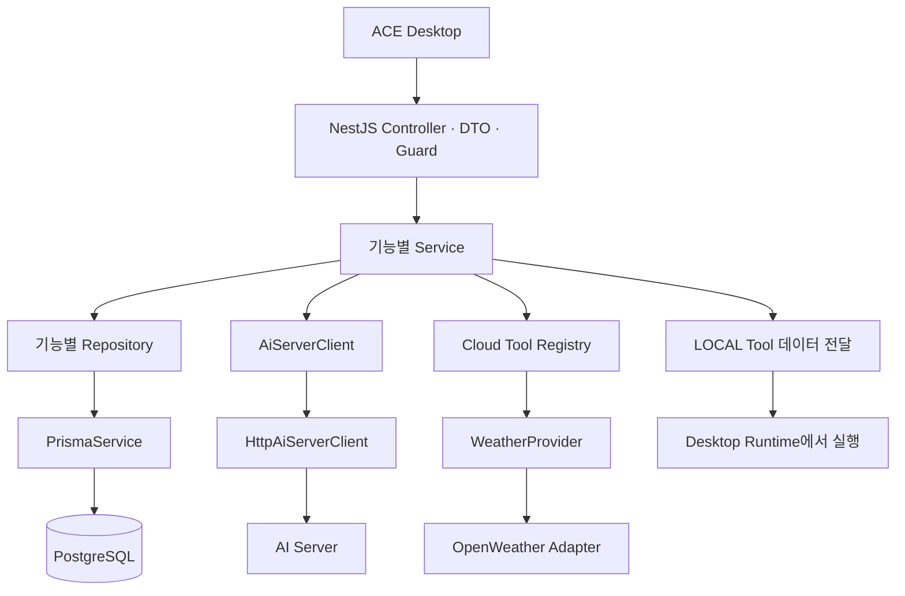

# 아키텍처와 확장 방법

## 계층별 책임

Controller는 DTO로 입력을 받고 인증 사용자를 전달합니다. User ID를 Request Body로 신뢰하지 않습니다. Service는 소유권, 복구 기간, Permission과 System Policy, Agent 흐름을 결정합니다. Repository는 Prisma의 타입이 보장된 Query를 수행합니다. 일반적인 Controller에는 Prisma 접근 코드가 없습니다.

`common/prisma`는 연결과 종료만 관리합니다. 비밀번호, 토큰, 대화, Permission 규칙은 해당 기능 모듈에 있습니다. `common/errors`는 원본 Prisma/외부 API 오류를 안전한 HTTP 오류로 변환합니다.

## 모듈 의존성

- `AuthModule`은 사용자 Repository와 Account 세션을 사용합니다. 전역 Guard는 서명·만료·발급자·대상·토큰 목적과 세션 활성 상태를 검증합니다.
- `MessagesModule`은 대화 소유권 검증에 `ConversationsService`를 사용합니다. 메시지 저장과 부모 대화의 활동 시각 변경은 하나의 트랜잭션입니다.
- `SettingsModule`은 실행 로직이 없는 `ToolCatalogModule`만 참조합니다. `ToolsModule`을 역참조하지 않아 순환 의존성을 피합니다.
- `ToolsModule`은 Catalog, Permission, Cloud Integration Registry, Weather, Logs를 조합합니다. LOCAL Tool은 실행 API에서 거부합니다.
- `AgentModule`은 입력 처리, 문맥 생성, AI 요청, 응답 검증·저장, 결과 전달, 티켓 검증을 별도 Service로 분리합니다.
- `LogsModule`은 Registry에서 알려진 Tool 이름과 정해진 상태·오류 코드만 기록합니다.

## 확장 지점

Weather Provider를 바꾸려면 `WeatherProvider`를 구현하고 `WeatherModule`의 DI 바인딩을 교체합니다. Agent와 Tool 실행 흐름은 유지합니다.

AI Server의 API 계약이 다르면 `AiServerClient`를 구현하거나 `HttpAiServerClient`의 변환만 변경합니다. Controller와 Prisma 모델에는 Provider 응답을 직접 섞지 않습니다.

Calendar/Email/Notion/GitHub를 추가할 때는 `integrations/<기능>/`에 `CloudToolHandler`를 구현합니다. Catalog에 Tool 이름·실행 위치·인자 스키마·System Confirmation을 등록하고 모듈 초기화 단계에서 `IntegrationRegistry.register()`를 호출합니다. 아직 필요하지 않은 외부 계정 연동·OAuth Token DB는 만들지 않았습니다.

OAuth 인증을 추가할 때는 `auth`의 인증 흐름과 `User` 모델의 인증 식별 구조를 검토해 Migration으로 확장합니다. 현재 인증은 이메일·비밀번호와 Account 단위 세션이며 Device에 연결하지 않습니다.

## 보안과 데이터 저장

- 비밀번호는 랜덤 Salt를 사용하는 Node.js scrypt 해시로 저장합니다. 비용은 N=131072, r=8, p=1이며 [OWASP 권장 scrypt 기준](https://cheatsheetseries.owasp.org/cheatsheets/Password_Storage_Cheat_Sheet.html)을 적용했습니다.
- Refresh Token은 SHA-256 Digest만 저장하고 원자적으로 교체합니다. 재사용 시 해당 세션을 폐기합니다. Access Token은 기본 15분, Refresh Token은 기본 30일입니다.
- 대화·메시지·설정·Permission·로그는 인증 사용자 조건을 Query에 적용합니다. 다른 사용자의 대화는 존재 여부를 노출하지 않고 404로 응답합니다.
- 메시지를 생성할 때 부모 대화를 조건부 갱신해 Row Lock을 획득한 후 저장합니다. 삭제와 동시 실행돼도 삭제된 대화에 메시지를 추가하지 않습니다.
- 클라이언트의 일반 메시지 API는 USER Role만 허용합니다. ASSISTANT/TOOL/SYSTEM Role은 내부 서비스가 관리합니다.
- Body와 외부 응답의 크기·시간을 제한합니다. 외부 오류 원문과 SQL/Stack을 API 응답이나 로그에 출력하지 않습니다.
- Tool Arguments와 원본 결과는 자동으로 Conversation이나 Log에 저장하지 않습니다. TOOL 메시지에는 `app.open: SUCCEEDED` 같은 정규화된 결과만 저장합니다. 사용자가 보낸 일반 메시지와 AI의 최종 텍스트 응답은 대화 데이터입니다.
- Tool 티켓에는 Arguments 원문 대신 Digest를 넣습니다. 현재 사용자·대화·Tool·호출 ID·만료 시간을 검증하고 Cloud 실행 인자가 바뀌면 거부합니다.
- LOCAL 결과는 Desktop이 보고한 결과이며 서버가 실행 자체를 증명하지 않습니다. Desktop Runtime은 실제 실행 전 로컬 보안 정책·Confirmation을 다시 검증해야 합니다.
- 티켓 재사용을 저장소에서 추적하지는 않습니다. 현재 Cloud Tool은 읽기 전용 Weather뿐입니다. 외부 쓰기 Tool을 추가할 때는 티켓 소비 기록과 Provider Idempotency Key를 함께 도입해야 합니다.

로그는 `userId`, `toolName`, `status`, 정해진 `errorCode`, `duration`, `createdAt`만 저장합니다. `deviceId`, Password, Token, Voice, Arguments, 원본 결과는 로그 모델에 없습니다.

주요 Agent Event는 `AgentEventsService`가 애플리케이션 로그에 기록합니다. Turn 처리와 Tool 결과의 AI 재전달은 이벤트 종류·성공/실패·처리 시간만 출력합니다. 원본 오류와 요청·응답 내용은 출력하지 않으며 이벤트 전용 DB 테이블은 추가하지 않았습니다.

## 관련 공식 문서

[NestJS Prisma 레시피](https://docs.nestjs.com/recipes/prisma)의 Prisma 7 CommonJS 구성과 PostgreSQL 어댑터를 사용합니다. [Prisma Migration CLI](https://docs.prisma.io/docs/orm/reference/prisma-cli-reference)를 통해 Schema에서 초기 SQL을 생성하고 버전 관리합니다. 개발 DB 실행은 [embedded-postgres](https://github.com/leinelissen/embedded-postgres)의 Windows 지원 바이너리를 사용합니다.
